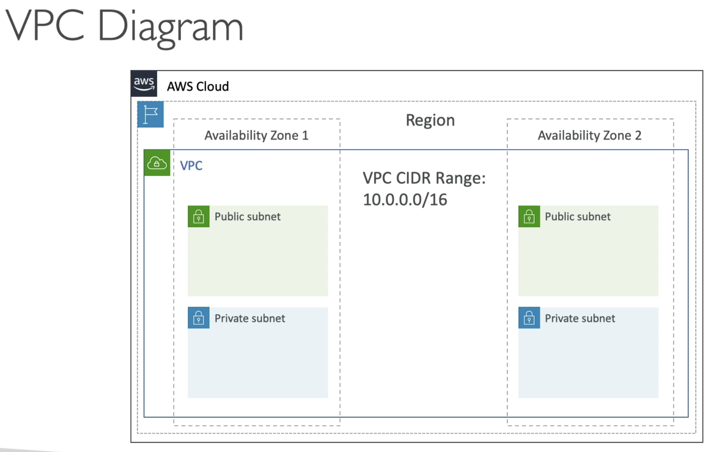

# VPC
## VPC and Subnets
- Virtual Private Cloud to deploy your resources(regional resource)
- Subnets allow you to partition your network inside your VPC (AZ resource)
- Public subnet is a subnet that is accessible from the internet
- Private subnet is a subnet that is not accessible from the internet
- Do define access to the internet and between subnets, we use Route Tables

- Default AWS creates public subnet for us
- Internet gateways helps our VPC instances to connect to the internet
- Public Subnets have a route to the internet gateway
- NAT gateway & NAT instances allow your instances in your private subnets to access the internet while remaining private

## Network ACL & Security Groups
- NACL
    - Firewall which controls traffic from and to subnet
    - Can have ALLOW and DENY rules
    - Are attached at the subnet level
    - Rules only include IP addresses
- Security Groups
    - A firewall that controls traffice to and from an ENI/ and EC2 instance
    - Can have only ALLOW rules
    - Rules include IP addresses and other security groups

## VPC Flow Logs
- Capture information about IP traffic going into your interfaces
    - VPC Flow Logs
    - Subnet Flow Logs
    - Elastic Network Interface Flow Logs
- Helps to monitor and troubleshoot connectivity
    - Subnets to internet
    - Subnets to subnets
    - Internet to subnets
- Captures network information from AWS managed interfaces too: Elastic Load Balancers, ElastiCache, RDS, Aurora, etc
- VPC Flow Logs data can go to S3 / CloudWatch Logs

## VPC Peering
- Connect two VPC, privately using AWS network
- Make them behave as if they were in the same network
- Must not have overlapping CIDR (IP address range)
- VPC peering connection is not transitive (must be established for each VPC that need to communicate with one another)

## VPC Endpoints
- Allow you to connect to AWS services using a private network instead of the public www network
- This gives you enhanced security and lower latency to access AWS services
- VPC Endpoint Gateway: S3 and Dynamo DB
- VPC Endpoint Interface: the rest
- Only used within your VPC

## Site to site VPN & Direct Connect
- Site to Site VPN
    - Connect an on-premises VPN to AWS
    - The connection is automatically encrypted
    - Goes over the public internet
- Direct Connect (DX)
    - Establish a physical connection between on-premises and AWS
    - The connection is private, secure and fast
    - Goes over a private network
    - Takes at least a month to establish